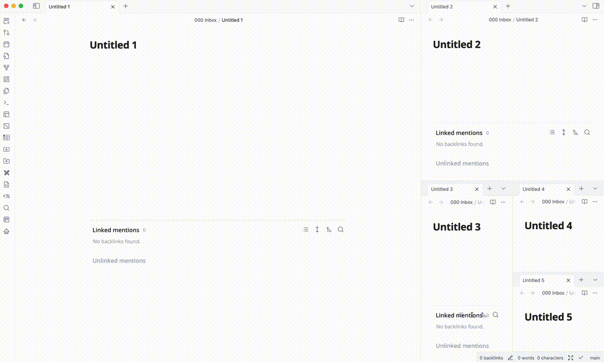

# obsidian-editor-group-arrangement

> Arrange your editor group in a more flexible way.

## Introduction

This is a plugin for [Obsidian](https://obsidian.md/), which provides a way to arrange the editor group in a more flexible way. Currently, the plugin supports the following features:

- Arrange action
  - Arrange evenly: this action will arrange the editor group evenly.
  - Expand active editor: this action will expand the active editor, and shrink the other editors to the minimum size. Just like what vscode does.
- Arrange Mode
  - Manual: Do nothing.
  - Auto Expand: Automatically expand the active editor when the active editor is changed or when you click on the editor tab.

## How to use

1. Install and enable the plugin.
2. Then you can make actions and switch modes from
   1. The status bar. You can find a clickable icon with tooltip `Editor Group Arrangement` when you hover on it.
   2. The command palette. Just type `Editor Group Arrangement` and you will find the commands.
3. Enjoy!

## Limitations

- The plugin is still in the early stage, so there might be some bugs.
- In some cases, after switching mode to auto expand, you should *change the active editor* or click on the editor tab to trigger the expand action.

## TODOs

- [ ] Write the README
- [ ] Fix some bugs that impact the basic functionality
- [ ] Use slider component for the min size for expand mode
- [ ] Support ratio mode, for example, 3:1, 1:2:1, 1:1:1:1 etc.
- [ ] Support ratio mode from UI. For example, user can drag the border/input ratio to change the ratio of the editor group.
- [ ] Support custom arrangement mode, by the workspace layout state provided by user. For example, the plugin can read the root split state from workspace layout, and then apply the arrangement to the editor group without replacing the open editors.
